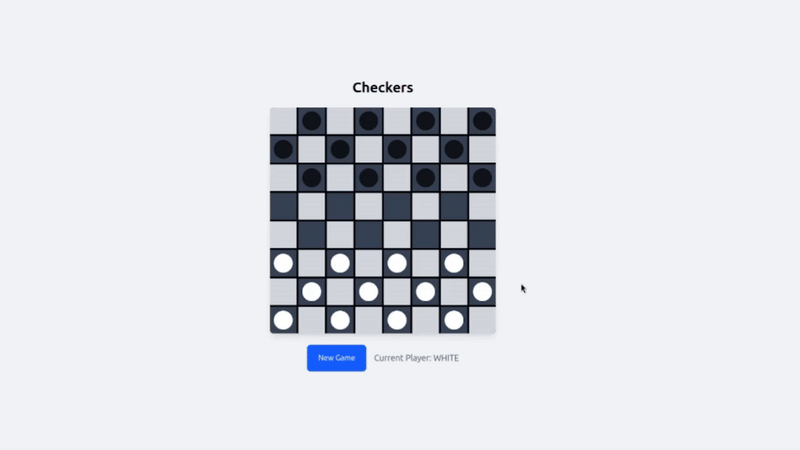

# Checkers

The traditional checkers game built with Angular and styled using Tailwind CSS, allowing two players to compete on a classic 8×8 board.



## Clone this Repository

```bash
git clone https://github.com/DenizAltunkapan/angular-projects.git
```

then type

```bash
cd checkers
```

## Install packages

```bash
npm install
```

## Development server

To start a local development server, run:

```bash
ng serve
```

Once the server is running, open your browser and navigate to `http://localhost:4200/`. The application will automatically reload whenever you modify any of the source files.

## Code scaffolding

Angular CLI includes powerful code scaffolding tools. To generate a new component, run:

```bash
ng generate component component-name
```

For a complete list of available schematics (such as `components`, `directives`, or `pipes`), run:

```bash
ng generate --help
```

## Building

To build the project run:

```bash
ng build
```

This will compile your project and store the build artifacts in the `dist/` directory. By default, the production build optimizes your application for performance and speed.

## Additional Resources

For more information on using Angular, visit the official documentation:  
[Angular Documentation](https://angular.dev)

For more information on Tailwind CSS, visit the official documentation:  
[Tailwind CSS Documentation](https://tailwindcss.com/docs)

For more information on Angular CLI commands and tools, visit the official CLI reference:  
[Angular CLI Overview and Command Reference](https://angular.dev/tools/cli)
