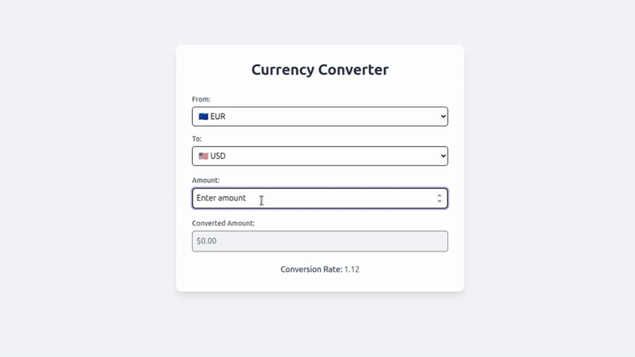

# CurrencyConverter

CurrencyConverter is a modern Angular application that allows users to quickly and easily convert between multiple currencies. The app supports a selection of the most important international currencies.

Supported currencies:

- USD – United States Dollar
- EUR – Euro
- GBP – British Pound Sterling
- INR – Indian Rupee
- JPY – Japanese Yen
- CHF – Swiss Franc
- CNY – Chinese Yuan
- AUD – Australian Dollar
- CAD – Canadian Dollar
- TRY – Turkish Lira



## Clone this Repository

```bash
git clone https://github.com/DenizAltunkapan/angular-projects.git
```

then type

```bash
cd profile-card
```

## Install packages

```bash
npm install
```

## Development server

To start a local development server, run:

```bash
ng serve
```

Once the server is running, open your browser and navigate to `http://localhost:4200/`. The application will automatically reload whenever you modify any of the source files.

## Code scaffolding

Angular CLI includes powerful code scaffolding tools. To generate a new component, run:

```bash
ng generate component component-name
```

For a complete list of available schematics (such as `components`, `directives`, or `pipes`), run:

```bash
ng generate --help
```

## Building

To build the project run:

```bash
ng build
```

This will compile your project and store the build artifacts in the `dist/` directory. By default, the production build optimizes your application for performance and speed.

## Additional Resources

For more information on using Angular, visit the official documentation:  
[Angular Documentation](https://angular.dev)

For more information on Angular CLI commands and tools, visit the official CLI reference:  
[Angular CLI Overview and Command Reference](https://angular.dev/tools/cli)
